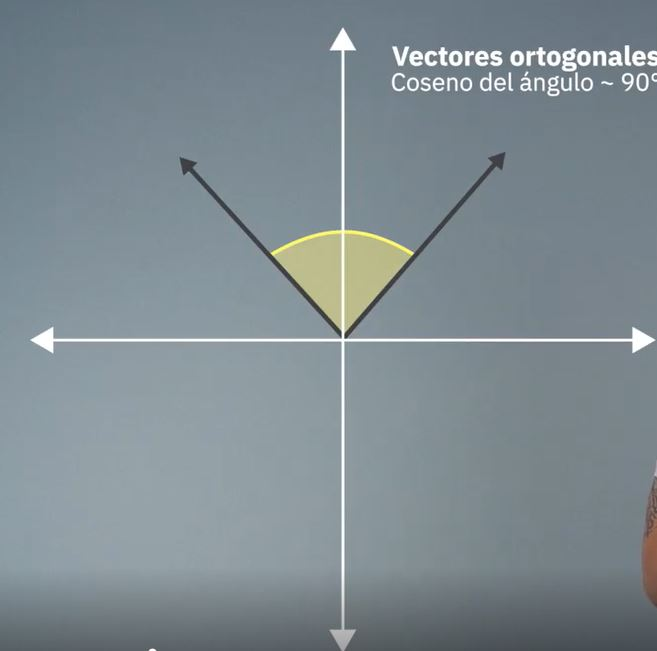
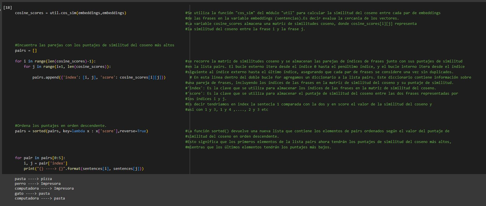

# Embeddings y base de Datos Vectoriales para NLP

## Clase 1 - Como una maquina entiende el lenguaje humano

En este caso, el resultado del cómputo de los embeddings es una matriz de tipo float32, donde cada fila representa el embedding de una frase en la lista sentences. Cada embedding es un vector numérico de alta dimensionalidad.

La dimensionalidad específica de los embeddings depende del modelo pre-entrenado utilizado. En este caso, el modelo "all-MiniLM-L6-v2"

Cada valor numérico en el embedding representa la fuerza o importancia de una cierta característica o atributo de la frase en el espacio vectorial. 

### Base de datos Vectoriales

Una base de datos vectorial es un tipo de base de datos que se utiliza para almacenar y buscar información basada en características o atributos vectoriales. En lugar de almacenar datos en forma de registros 
y campos como en una base de datos relacional tradicional, una base de datos vectorial almacena los datos en forma de vectores.

En una base de datos vectorial, cada registro o entidad se representa como un vector multidimensional, donde cada dimensión o atributo del vector corresponde a una característica específica. Estos atributos pueden ser numéricos,
como coordenadas geográficas, o pueden ser atributos categóricos, como palabras clave o etiquetas.

La base de datos vectorial permite realizar operaciones de búsqueda y recuperación de información utilizando técnicas de similitud y distancia vectorial. Por ejemplo, se pueden buscar registros similares basados en la similitud
de sus vectores, utilizando algoritmos como la similitud del coseno o la distancia euclidiana.

Las bases de datos vectoriales se utilizan en diversas aplicaciones, como sistemas de recomendación, búsqueda de información, análisis de datos científicos y minería de datos. Son especialmente útiles cuando se trata de 
datos que tienen una estructura vectorial inherente y cuando se requiere realizar consultas basadas en similitud o proximidad.

### Proyecto del curso

### Métodos tradicionales: One-Hot Encoding y TF-IDF

Mapea cada palabra a un vector, no tengo forma de comparacion de palabras y es muy extenso el mapeo

### TF-IDF

 Busca las palabras mas revelantes o inusuales en varios corpus
 
 TF-IDF se basa en dos conceptos principales:

Frecuencia de término (TF - Term Frequency): Mide la frecuencia con la que aparece una palabra en un documento específico. Cuanto más frecuente es una palabra en un documento, mayor será su puntuación de TF.

Frecuencia inversa de documento (IDF - Inverse Document Frequency): Mide la importancia de una palabra en el contexto de una colección de documentos. Se calcula como el logaritmo del número total de documentos dividido por el número de documentos que contienen la palabra en cuestión. Una palabra común que aparece en muchos documentos tendrá un IDF más bajo, mientras que una palabra menos común tendrá un IDF más alto.

La puntuación TF-IDF se calcula multiplicando la puntuación de TF de una palabra por su puntuación de IDF. 

La idea es determinar las palbras que menos se repiten y menos frecuencia tienen que tiene mas relevancia en el texto comparadas con palabras que se repiten mucho y tienen menos relevancia

La comparación de palabras utilizando TF-IDF implica calcular las puntuaciones TF-IDF para cada palabra en una colección de documentos y luego comparar las puntuaciones para determinar la relevancia de las palabras en diferentes contextos o documentos.

Desventjas de TF-IDF:
1- No hay orden de aparicion de palbras

2 - no permite compara palabras con otras

3 - dificil de calcular

En el contexto de la vectorización de palabras, la dimensión se refiere al número de componentes o características utilizadas para representar una palabra en forma de vector. Cada palabra se representa como un vector numérico en un espacio de alta dimensionalidad, donde cada dimensión corresponde a una característica específica.

Existen varias técnicas de vectorización de palabras, y cada una tiene su propia forma de asignar valores a las dimensiones del vector. Algunas de las técnicas más comunes incluyen:

*One-Hot Encoding: En esta técnica, cada palabra se representa como un vector binario de tamaño igual al tamaño del vocabulario. Un único elemento del vector se establece en 1 para indicar la presencia de la palabra en el texto y los demás elementos se establecen en 0. Por lo tanto, la dimensión del vector es igual al tamaño del vocabulario.

*Word Embeddings: Estas técnicas, como Word2Vec o GloVe, asignan vectores de valores reales a las palabras. Cada dimensión del vector representa una característica semántica o contextual de la palabra. Normalmente, estos vectores tienen una dimensión fija y predefinida, como 100, 200 o 300 dimensiones.

*Transformadores (Transformers): Los modelos basados en transformers, como BERT o GPT, utilizan una arquitectura de red neuronal con múltiples capas de atención y convoluciones para generar representaciones vectoriales de palabras. La dimensión de los vectores generados por estos modelos también es predefinida y suele ser más alta, como 768 o 1024 dimensiones.

En esta imagen en la parte superior a 45 grados tenemos las dimensiones y/o caracteriesticas y en el lateral derecho la palabra en cuestion luego el vector contiene el valor semantico de cada palabra con respecto a la dimension correspondiente, lo que indica como la dimension esta correlacionada al sentido semantico de la palabra.

### Ejemplo dos dimensiones

en el plano cartesiano el eje y represento la dimension edad y en x la dimencion genero. S

hombre esta al incio de x lo que indica genero masculino y arriba en y lo que indica hombre de edad aanzada

En termino matematicos podriamos representar los vectores asi:

Agregamos las palbras niño y niña

Agrgo dso palabras sin dependencia de genero

### Espacio de tres dimensiones

Agrego una dimension llamada realeza

## Percepcion del sentido semantico de las palabras a nivel numerico

si al vector rey le resto el vector hombre matamaticamente obtengo como resultado el vector realeza. Y si le sumo el vector mujer obtengo matematicamente el vector reina.

##Mientras mas dimensiones tenga mi modelo sera mas especifico pero requerira mas recursos computacionales

## Distancias entre vectores

La distribución semántica se refiere a la idea de que las palabras con significados similares o que se utilizan en contextos similares tienden a tener representaciones vectoriales cercanas en el espacio. Es decir, las palabras que están relacionadas de alguna manera tienen vectores que están cerca entre sí en términos de distancia.

Cuando las palabras están cerca en el espacio vectorial, esto sugiere que tienen similitudes semánticas o se utilizan en contextos similares.

La distancia entre palabras representadas por embeddings puede ser utilizada para diferentes tareas de procesamiento de lenguaje natural, como la búsqueda de palabras similares o relacionadas, la detección de sinónimos o la resolución de analogías. 

### Metricas para calcular la distancia entre vectores o Similitud semantica

### 1.Similitud o Distancia por coseno

### 2.Distancia Euclediana

Calcula la distancia entre vectores por medio de la resta de los mismos

### 3.Producto escalar

## Notebook_2

